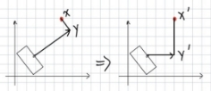
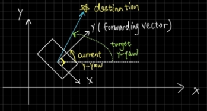
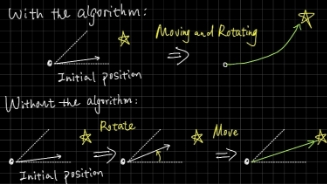
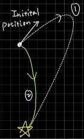
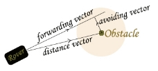
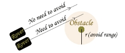
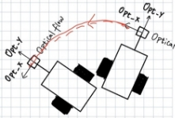

**Mars Rover 2022 Design and Implementation**

**Imperial College London**

**Department of Electrical and Electronic Engineering**

Group 24

Quix Fan				EIE		 		01854239

Kaiwen Liu				EIE		 		01845986

Jue Wang				EIE		 		01870019

Zhengyu Chen	  		EIE				01736885

Xuan Cai 				EIE				01860896

Mike Zhang				EEE				01846538

Liheng Rong			EEE				01909541

## Background and Abstract

Hundreds of years ago when the human race discovered that the earth is just a planet in the universe with countless stars, planets, meteors and other celestial bodies, the dream of exploring the universe sprouted in peoples’ mind. Since 1957 the Soviet Union launched the first ever artificial satellite in human history, the expedition to other celestial bodies became possible. In 1971, the Soviet Union launched two Mars rovers. However, the first one collapsed during landing while the second one though successfully landed only worked for 14 seconds before it lost connection with the earth. It was twenty-six years later that the first Mars rover that successfully operated, Sojourner, landed on Mars. It was equipped with solar panels to charge the battery and cameras to take photographs and distinguish and avoid obstacles when necessary. The later versions of Mars rovers from the USA are equipped with more advanced sensors, and more importantly, they use Radioisotope Thermoelectric Generator, which can supply electricity for dozens of years before running out, so they don’t need solar panels anymore.

The Mars rover implemented in this project is slightly different from the real ones. We do have solar panels and the obstacle avoidance system as well, but in addition ours is equipped with a doppler radar to detect aliens’ underground infrastructure and a remote-control system for users to give commands. Though it’s impossible for scientists to remotely command real Mars rovers because it takes minutes for signals to transfer between the earth and Mars, we still implemented this function as instructed. The overall goal of our Mars Rover project is to design and implement a rover that can automatically explore an unknown test area while can be remotely controlled if users wish to. It is powered by a 5V2.1A portable charger and solar panels are mounted on its back to charge the portable charger under good weather conditions. The driving system of the rover includes two DC motors and an optical flow sensor supervising the direction and distance of the rover heading. The rover is designed to automatically recognize and avoid aliens and obstacles by using a D8M camera and a DE10-Lite FPGA. It is also equipped with a doppler radar which can detect aliens’ underground infrastructure. A map of the area with the positions of the aliens, obstacles and their underground infrastructure marked will be drawn up as the exploration goes on. A web app is implemented for users to view the map and remotely control the rover. In this report we will describe how the rover was designed and implemented from.

## High level design

In this project, we are aiming to design a fully functional Mars Rover which can explore the whole planet and detect alien and their building automatically while doing its own path planning, and a ground station should also be implemented for data display, storage and remote control.

To meet the requirements, we decided to divide the design and implementation work into 6 sub-modules according to the hardware used, each in charge of one or more functions, including drive, energy, vision, control, command, and radar. The control sub-module acts as the head of the rover with an ESP32 chip controlling all other sub-modules to work in parallel, which is the preliminary for all. It is connected to all the functioning modules, receiving their data, and giving out orders. The software of this project is also implemented module by module. We write code for each functioning module while FreeRTOS in the ESP32 takes charge of all the sub-modules to achieve the final goal of the task.

Overall, our rover is made from functioning modules that have been tested and proved to work before they are implemented into the entire system.

**Vision**

The vision module aims to specify the encountered obstacles according to its color and calculate its relative position from the rover as accurately as possible. It generally consists of 4 parts: RGB to HSV conversion, filtering process, color detection, pixel weighting mechanism, and center point calculation. And all the calculations are carried out on the DSP module of FPGA.

**RGB to HSV conversion**

The reason why HSV color space is used for color detection rather than RGB/BGR is that HSV is more robust towards changes in external ambient light. Initially, a piece of 24-bit RGB, 8 bits for each letter, is converted to the corresponding 24-bit HSV with 8 bits for each letter as well. This is achieved by Hue, Saturation, and Value computation respectively. 

**Filtering Process and Color Detection**

After the HSV values are obtained, the glitch and high frequency noise would be eliminated by the average filter, which contains a shifting register and calculate the mean value stored in it to get the final filtered output, so the quality of HSV signals would be improved. Then the filtered values of HSV will be fed into the color detection process, where if the pixel fits in a certain range of HSV, the corresponding color will be sent out. Additionally, we developed a system to fit an online HSV color range modification software, which was implemented through OpenCV and transfers the result by JTAG UART and a self-development communication protocol to adjust values without modifying the Verilog code for the vision system, making the developing process much more efficient.

**Pixel Weighting Mechanism**

To find the accurate position of the detected obstacle, we need to find how many valid pixels there are in the image and the center point for all those color-valid pixels. To do this, we established a weight calc module to get the weighted average center coordinate of the pixels. The weight for each color-valid pixel stands for the parameter of its importance in the whole image. It is determined by its adjacent pixels, for each valid-colored object should have a range of color-valid pixels rather than single ones, therefore white noise and glitches are considered having no color-valid pixels. So higher weight is assigned to continuous color-valid pixels in a certain range and lower weight is assigned to single color-valid pixels. The weight calc module includes a shift register with a size of 30 bits and the weight of each bit decreased from MSB to LSB. As a result, the aggregated same color pixels will have a higher weight so the impact of noise colors in the background will be decreased when calculating the center of the pixels. 

**Center Point Calculation**

After that, the calculated weight for each detected color will be added to the **x\_increment**, **y\_increment** and **xy\_count (sum of the weight)** variables so that bounds for each pixel are updated.

As for the Center-point Algorithm, it is based on the formula: 

If valid color detected, then(the value for the following was saved separately for different colors)

***xy\_count += weight***

***X\_increment += x\*weight***

***Y\_increment += y\*weight***

Once finished one frame

***weighted average x-position = x\_increment / xy\_count***

***weighted average y-position = Centered y-position = y\_increment / xy\_count***

***Centered x-position = weighted average x-position - 320 (set the center point’s x coordinate to be zero as the width of the image is 640)***

Eventually, the position of the obstacle’s center point is specified clearly and stably.

**Alien Building Detection**

Since the alien and the building are slightly different, we calculate the average weight sum of the black pixels on each row instead of xy\_count, then that can be used to determine the size and distance of the building. In practice, an extra ultrasound sensor can be used to increase the quality of distance detection which improves the quality of Alien building avoidance.

**Relative/Absolute Position Calculation**

By using rational function fitting for referring y\_center, xy\_count with the real y-distance to the test results. Then according to the Similar Triangle Principle, we get **x\_distance** by multiplying the **y-distance** with the ratio of **x-center** to **y-center** which can be conducted** by the test result. In this way, in practice, we achieved a distance estimation with a precision of +-1cm

 ****

Besides, since we only know the relative position of the obstacle detected, we need to transfer it into the absolute position by linear rotation transformation. The absolute position was used for obstacle avoidance system. The angle below is the yaw angle of the rover.

**Communication**

The communication part is accomplished by a **Message FSM** which has 4 states. When msg\_state=0, the FSM does nothing and waits for the starting signal. If the current message needs to be sent, msg\_state will be set to 1 and an initial message(0xFFFF) was written to FIFO. During states 2 and 3Message Writer States), to distinguish color, msg\_color, initialized as 0, will cycle through all the color codes and stop at the value of the specified color code value. And all messages are sent with the same information but in different forms. When msg\_state =2, **xy\_count** with the specified color code will be sent to Nios II. When msg\_state=3, both x\_center and y\_center with specified color code will be sent.

**From DSP to Nios II to ESP32** 

In addition to the Image\_proc module, we also used a Nios II system to send the processed information from Message FIFO to ESP32 by UART as inputs for obstacle detection and dynamic obstacle avoidance. Moreover, processes such as FIR filtering, auto focus and bins level set also take place on Nios II and can lower down computation workload for ESP32.

**Obstacle Detection**

This part was mainly developed on ESP32 side, which used the raw data from the obstacle position estimation algorithm. We determined a range of valid range of variance of updating obstacle position and distance between the rover and obstacle to determine whether we need to consider the detected obstacle as a valid real obstacle and add that into the obstacle list. In addition, if the detected obstacle shares a similar coordinate with the someone in the obstacle list, we will apply a FIR filtering algorithm to update its coordinates in the obstacle list which will provide a better quality of Mars map. In the test, the obstacle can be detected and updated in real time on the front-end map.

**Command**

The ground control sets up communication with the rover in LAN via the Web socket used for control and sensor data exchange. In this way both local and remote communication can be implemented, and real time full duplex communication is achieved, which is a huge advantage compared with using application layer protocols such as HTTP or MQTT. In addition, we can display the real-time data on the Vue.JS based front end and store part of the data to a MySQL database at the ground station that provides permanent data storage service for the rover. Also, we develop a python-based ground station and simulator for the rover as an alternative for the command system.

***Web application page (desktop & mobile):***

**Remote Controller**

Converting x, y coordinates (motion) of the controller to control signal: speed and direction of left and right motors. 

Sliding blocks to adjust control parameters: speed, sensitivity, etc.

Switches used to start connection or enable manual remote control.

An Xbox joystick-based control system was also implemented.

**Monitor & Mapping**

By receiving x, y motion of the rover obtained from the ESP32 (detail of calculation written in the drive module above), the front end will map the route of motion to canvas component which draws lines between the given coordinates.

The x, y coordinates and colours of aliens obtained and processed by vision module will also be sent to command module, mapped, and updated simultaneously.

**Data Display**

x, y, yaw, quality of optical flow sensor and message received will be directly displayed on the panel, and there is also graphic representation of the yaw in the form of compass.

**Data Setting Protocol**

A protocol was developed to make the data setting from the ground station to the rover possible. We can set the target yaw, target position, and some other data easily now. The protocol was byte stream based with a header of $, a buffer was created on the ESP32 web socket side to receive and process the data.

**Test**

In the test, the command system achieved real time communication and control for the rover, which greatly improved the debugging process and providing useful information which has been detected by the rover.

**Control**

The aim of the control system is to enable the rover to find a route to the target position and dynamically avoid the detected obstacles in its way. It obtains the information needed from the navigation system and the obstacle detection system based on the vision system and outputs the control value for both motors. For target position control, we use a cascade PID controller together with a main route planner to explore the whole area, which achieves a high-quality control compared to the hard coded control systems which is open-looped and do not contain a continuous control system to adjust error. For the obstacle avoidance system, since the Mars rover will be new to the planet, we do not have the complete map of it, so path finding algorithms such as A\* path finding algorithm or Dijkstra algorithm are no longer suitable since they require to re-calculate the new path when a new obstacle was added to the map. Also meshing was introduced so less efficiency on the final path if without curve fitting. Therefore, we introduced a completely new algorithm which enables the rover to dynamically avoid obstacles without meshing or path finding. In this way, a curved path and much less computation workload would be achieved. Furthermore, higher obstacle-avoidance quality can be achieved even for the “moving” aliens. 

**Main structure of the system —— Cascaded PID Controllers**

Our control system includes mainly 3 parts, Position controller, Velocity controller and Yaw controller. After receiving the destination position from the route planner. Position controller will process and output it to Velocity controller. Then Velocity controller will output a controlled quantity of velocity based on the velocity difference. Meanwhile the DOA (Dynamic obstacle avoiding) module will give out an avoiding angle. The final throttle module outputs the final throttle value based on the difference between the current yaw and target yaw, which enables the rover to start turning towards the correct yaw before starting to move forward. They add up to give the rotation speed of the two motors as described below

***Yaw\_control=output from the yaw controller***

***Throttle\_control=output from the final throttle module***

***Motor 1 speed = Yaw\_control + Throttle\_control***

***Motor 2 speed = -Yaw\_control + Throttle\_control***

Considering the case that the difference between target\_yaw and current\_yaw can exceed the range of  -180° to 180° which is invalid for the PID controller. So, an Angle\_difference function is implemented to ensure the angle difference has fit in the correct range.

**Final Throttle Calculation Module**

As described above, this module was used to make sure the throttle was controlled under a suitable range. When Δyaw is within threshold angle, the rover will move towards the correct yaw and start moving forward instantaneously. (See Figure1) When Δyaw is larger than threshold angle, the rover will not be moving till the angle difference falls back below the threshold angle and then start to move in the same way of Figure1. (See Figure2). Consequently, it prevents the rover from taking the longer No.1 route in Figure2. 

**Throttle\_control = (- Δyaw /threshold\_angle+1)\*control value from velocity controller (if Δyaw<= threshold\_angle)**

**Throttle\_control =0 (if Δyaw > threshold\_angle)**

**Dynamic Obstacle Avoidance (DOA)**

The main idea of Dynamic Obstacle Avoidance includes two parts, one is to determine whether the detected obstacle is required to compute the DOA control, and one is to calculate the avoidance control value for the valid obstacles. The DOA algorithm could either be carried out by vector-based method or an angle-based method which both were developed by us.

**Vector based Method:** 

When we detect an obstacle by vision, we will create an avoiding circle range around it, which is used to check whether the rover needs to change the forwarding vector to avoid it. For instance, if the forwarding vector does not cross the avoiding range we set, there is no need to avoid, vice versa.

Once we know we need to do avoidance, the perpendicular vector of the forwarding vector will be assigned as the avoiding parameter. Depending on the size of the avoiding vector we can decide the quantity of the avoiding vector for they are positively proportional to each other.

Using the projection formula, we can find the projection of distance vector on the forwarding vector. By using the relation **raw** ***avoiding vector = (distance vector – μ\*forwarding vector)***, the size of avoiding vector is the direction for avoiding. When modulus of the raw avoiding vector is small, the rover needs to have an exceptionally large avoiding velocity, vice versa. The same for the modulus of distance vector. 

***Final avoiding vector = unit raw avoiding vector \* avoiding extent(calculated from modulus of raw avoiding vector and distance vector)***

**Angle based Method:**

The core of this method is that the rover will only consider the range from the -90° to 90° in its relative coordinate system which could reduce repeated computation as long as the rover passes the obstacle. (See the right-side figure) 

***Angle Diff=Angle difference between current yaw and toward angle for the obstacle (See the right-side figure)***

***Avoiding angle=(90-Angle Diff)\*(0.5\*Angle Diff+45)/90***

Clearly, smaller the angle difference, larger the avoiding angle.

Besides, the distance of rover to the obstacle also affects the avoiding angle. Closer the distance, the larger the avoiding angle.

Therefore, we got **Total change in direction = sum of ( avoiding extent \* avoiding angle \* distance factor \* distance weight) for each obstacle.** 

Where **distance factor= (detection range-obstacle distance)/ detection range**

**distance weight=distance factor for this obstacle / total distance factor sum**

**Avoiding extent**: a quantity used to determine the extent of avoidance)

**Distance weight**: a quantity used to prevent angle superposition when we detect a lot of obstacles at the same position.

**Simulated routes of the rover by python using angle-based method:**

**(green/red determines the avoidance status of the rover, better to debug)**

Finally, we **chose the angle-based method** to operate on the rover.

**Route Planning**

Since we get a powerful position-based controller, we can now set serials of target position the rover would go, then it will go to those points and automatically avoid the detected obstacles. Once the rover reaches the target position, then the planner system either on the remote side or the rover side can automatically set the next position target if that is not the final position. In the test, the rover moves accordingly to the planed route and dynamically avoids the encountered obstacles.

**Drive and Navigation**

The drive & navigation system includes a TB6612 motor driver chip, an optical flow sensor, an gyroscope and 2 DC motors with wheels. It can be seen from its components that the goal of the drive system is to enable the rover to navigate around the unknown area in the way the controlling chip ESP32 tells it to. Furthermore, the optical flow sensor and gyroscope can provide the information on its distance travelled in the x and y directions together with its yaw angle status to ESP32 so the position of the rover can be estimated, which is vital for map drawing and the control system.

**Optical Flow based Navigation & Basic motor drive**

By setting high or low for controlling pins, duty cycle of PWM inputs of the driver chip, it’s not hard to control the motors’ rotation speed and rotation direction. However, due to the physical properties of the motors, there is no way to guarantee that the rover will operate perfectly as we want. For example, if we write in code commanding the rover to go straight for 1 meter, it is very likely for us to observe deviations in both yaw and distance. Even it’s just a deviation of a few degrees in yaw and 2-3 centimeters in distance, the accumulation after some turns would have a massive decrease in the accuracy of the map drawn. Therefore, the optical flow sensor acts a vital role in supervising the course of the rover. The integration of the X value obtained from the optical flow sensor can be used as the yaw angle and sent to the main control system to create a closed-loop system to decrease the error.

***OpticalFlowX / Y = sum of OpticalFlowSpeedX / Y***

***Yaw Angle = OpticalFlowX \* Yaw Coefficient***

***X position = sin (Yaw Angle) \* OpticalFlowY***

***Y position = cos (Yaw Angle) \* OpticalFlowY***

**Sensor fusion**

Unfortunately, it was found when testing the drive system that the optical flow sensor is not accurate enough as well. It often gives a value of yaw different from the truth. To solve this problem an inclinometer is installed. The integral of yaw angular speed, the optical flow sensor and the integral of the difference of the control variables of the two motors are passed through a first-order complementary filter to obtain a final degree of yaw. We chose the first-order complementary filter because it acts more acute towards changes and requires less calculation than Kalman filtering or second-order complementary filter. This helps us better estimate the current position of the rover, which plays an inevitable role in map drawing and route planning. The following formula is the basic algorithm for this filter, where ***a*** is a coefficient to adjust the confidence of the data accuracy.

***y'=a\*y+(1-a) \*x***

**Conclusion**

The drive system works as follows: it receives motor command from the ESP32 control system and feeds the navigation information back enabling the rover to carry out its job properly. In the test, the motor can move smoothly with the control value come from the control system and provide valid navigation information.

